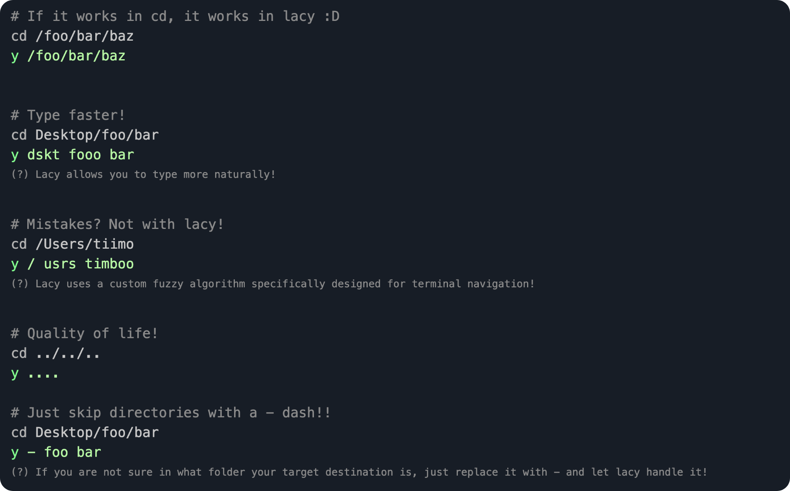

<div align="center">

<h1>Lacy</h1>

Lacy is a ${{\color{Lavender}\textsf{magical\ cd\ alternative}}}\$  that makes navigating much more efficient!
<br>
<br>
<sup>
⭐ Consider starring this repo – your support motivates me a lot! ⭐
</sup>
<div>
<a href="https://crates.io/crates/lacy">
  
</a>
<a href="https://crates.io/crates/lacy">
  
</a>
<a href="https://github.com/timothebot/lacy/">
  
</a>
</div>

<br>
<a href="https://lacy.tiimo.space/install">Install</a>
&nbsp;~&nbsp;
<a href="https://lacy.tiimo.space/setup">Setup</a>
&nbsp;~&nbsp;
<a href="https://lacy.tiimo.space/faq">FAQ</a>
&nbsp;~&nbsp;
<a href="https://lacy.tiimo.space/">Documentation</a>
<br>
<br>



</div>

Not convinced yet? Check out [all features](https://lacy.tiimo.space/features)!

---

## Contributions

Feel free to open a PR for any type of changes!

## AI notice

The code in this repository was written by hand. AI was used for the different shell configurations.

---

Built with <3 by [timothebot](https://github.com/timothebot)

<br>

*Haven't found what you are looking for? try looking in the [docs](https://lacy.tiimo.space/) :)*


```r
# If it works in cd, it works in lacy :D
cd /foo/bar/baz
y /foo/bar/baz


# Type faster!
cd Desktop/foo/bar
y dskt fooo bar
(?) Lacy allows you to type more naturally!

# Mistakes? Not with lacy!
cd /Users/tiimo
y / usrs timboo
# (?) Lacy uses a custom fuzzy algorithm specifically designed for terminal navigation!

# Quality of life!
cd ../../..
y ....


# Just skip directories with -!!
cd Desktop/foo/bar
y ....
(?) If you are not sure in what folder your target destination is, just replace it with - and let lacy handle it!
```
